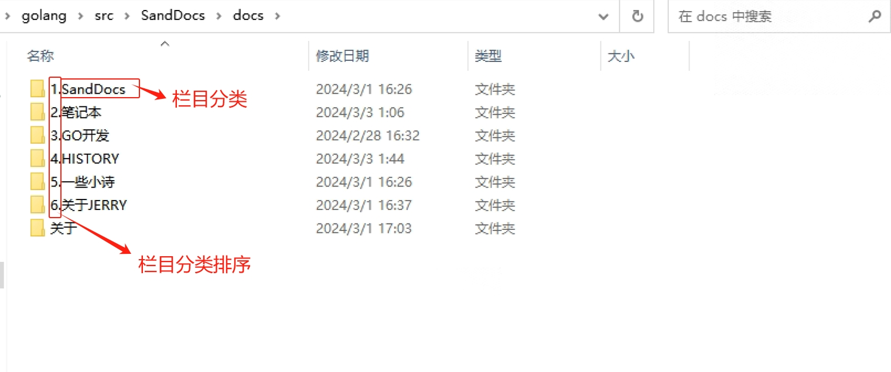
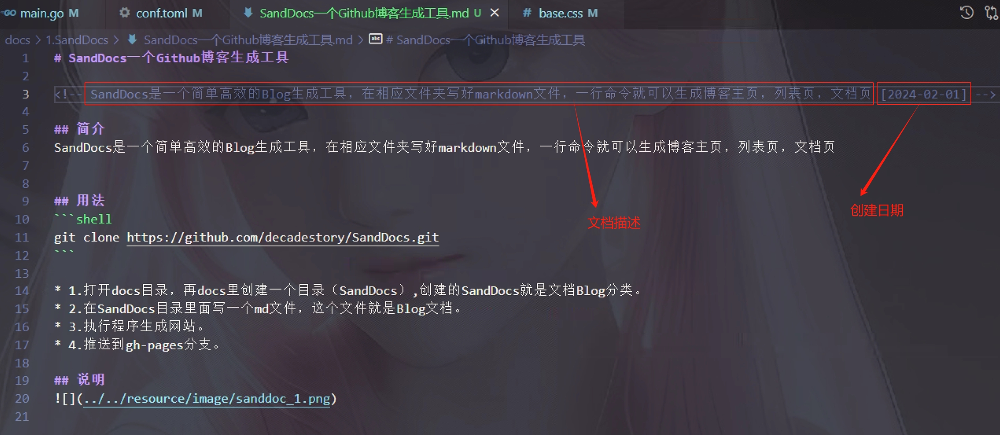

# SandDocs一个Github博客生成工具

<!-- SandDocs是一个简单高效的Blog生成工具，在相应文件夹写好markdown文件，一行命令就可以生成博客主页，列表页，文档页 [2024-02-01] -->

## 简介
SandDocs是一个简单高效的Blog生成工具，在相应文件夹写好markdown文件，一行命令就可以生成博客主页，列表页，文档页


## 用法
```shell
git clone https://github.com/decadestory/SandDocs.git
```

* 1.打开docs目录，再docs里创建一个目录（SandDocs）,创建的SandDocs就是文档Blog分类。
* 2.在SandDocs目录里面写一个md文件，这个文件就是Blog文档。
* 3.执行程序生成网站。
* 4.推送到gh-pages分支。

## 说明



